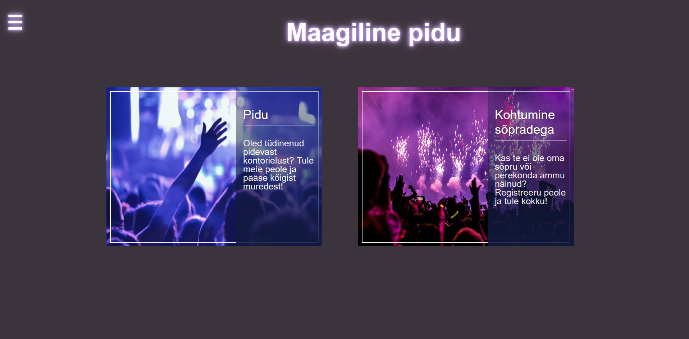

# Peoõhtu registreerimisvorm
<div align="center">
    

</div>

_**Minu projekt, on vormi sait sirvida ja registreerida kasutaja-poolne puhkus**_
> Projekt kasutab kahte kasutajat, administraatorit ja tavakasutajat.
>
> Tavakasutajal on ainult üks lehekülg, kuid administraatoril on 2 lehekülge.
> 
**See on kood, mis paneb kasutajad nägema kõiki osapooli/sündmusi.**
```
    <?php
    global $yhendus;
    $kask=$yhendus->prepare("SELECT Id, Tuup, PiduNimi, Aeg FROM pidu");
    $kask->bind_result($id, $tuup, $pidunimi, $aeg);
    $kask->execute();
    while ($kask->fetch()) {
        echo "<tr>";
        echo "<td>".$tuup."</td>";
        echo "<td>".$pidunimi."</td>";
        echo "<td>".$aeg."</td>";
        echo "</tr>";
    }
    ?>
```
## About The Project

<a href="https://darjamiljukova22.thkit.ee/jsleht/content/andmebaas/proekt/">
    
</a>


### Projekt loodi koostöös
* [![XAMPP][XAMPP-shield]][XAMPP-url]
* [![PHP][PHP-shield]][PHP-url]
* [![CSS][CSS-shield]][CSS-url]

## Kasutaja tee

- [ ] Registreerimine
- [ ] Logi sisse
- [ ] Peo vaatamine
    - [ ] Registreerimine pidule
- [ ] Logi välja


## Admin tee

- [ ] Autoriseerimine
- [ ] Kasutaja andmed vaatamine
    - [ ] Kustuta kasutaja andmed    
- [ ] Peo vaatamine
    - [ ] Lisamine pidu andmed
    - [ ] Kustutamine pidu andmed
    - [ ] Muutmine pidu andmed
- [ ] Logi välja


[XAMPP-shield]: https://img.shields.io/badge/XAMPP-F37623?style=for-the-badge&logo=xampp&logoColor=white
[XAMPP-url]: https://www.apachefriends.org/index.html

[PHP-shield]: https://img.shields.io/badge/PHP-777BB4?style=for-the-badge&logo=php&logoColor=white
[PHP-url]: https://www.php.net/

[CSS-shield]: https://img.shields.io/badge/CSS-1572B6?style=for-the-badge&logo=css3&logoColor=white
[CSS-url]: https://developer.mozilla.org/en-US/docs/Web/CSS

[product-screenshot]: images/skrin.png
